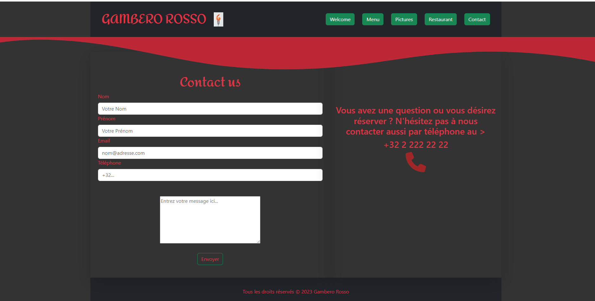

# Restaurant-css-framework- **GAMBERO ROSSO**
### Description
Le Restaurant GAMBERO ROSSO est un projet de site web pour un restaurant. Il présente page d'accueil, menu, gallerie de photos, contact, les heures d'ouverture, et permet aux utilisateurs de réserveret passer des commandes en ligne.
### Fonctionnalités
- Page d'accueil avec description du restaurant avec promo et event du l'établissement.
- Espace pour réserver et passer une commande.
- Menu detaillé du plats et boissons avec ingredients et prix.
- Galerie de photos avec descriptif de nos plats.
- Information géneral sur le restaurant par exemple adresse methode de payments et horaires d'ouverture.
- formulaire du contact pour nous transmettre un message.
### Tecnologies utlisés
- HTML
- CSS
- JAVASCRIPT
- BOOTSTRAP
- GIT
- GITHUB
### Resources
- Readme 
- Bootsrap site
- Unsplash
- Google
### Screenshots

### Auteur
***Riadh Trabelsi***
### Lien
https://riadh-trabelsi.github.io/restaurant-css-framework/